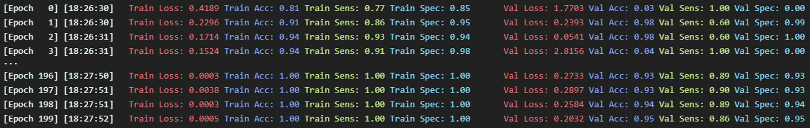

# Seizure Detection using Adaptive Learning

Tutorial: [Link](tutorial.ipynb)

## Modules

- Dataset + Feature Extraction
    - Download a specific patient files
    - Extract windows and labels of patient (from files)
    - Sample from windows (fro trainset)
        - Retain non-seizure windows adjacent to seizure windows
    - Feature extraction 
        - Spectral power and line length
    - EEGDataset
        - Pytorch dataset wrapper
    
    Example:
    

- Offline and Online train
    - Offline train
        - Before conducted on the patient
    - Loss and accuracy plot
    - Evaluation
        - Confusion Matrix
        - Accuracy
        - Sensitivity
        - Specificity
        - F1-Score
        - AUC
        - ROC
    - Adaptive learning 
    - Accuracy and sensitivity over time plot

    Example:
    

## Results and comparison with SOUL paper

### Setup
- Dataset: CHB-MIT Scalp EEG Database
- Patient number: `8`
- Dataset Partitioning
    - Train: `26%`
    - Validation: `5%`
    - Test: `69%`

### Linear Regression

- Offline train 
    

    

- Parameter tunning
    

- Evaluation
    

- Accuracy and Sensitivity over time (Adaptive Learning Phase)
    

### MLP 

**Note**: Only the last layer will be re-trained during adaptive learning phase

- Offline train 
    

    

- Parameter tunning
    

- Evaluation
    

- Accuracy and Sensitivity over time (Adaptive Learning Phase)
    

### CNN

**Note**: Only the last (linear) layer will be re-trained during adaptive learning phase

- Offline train 
    

    

- Parameter tunning
    

- Evaluation
    

- Accuracy and Sensitivity over time (Adaptive Learning Phase)
    
